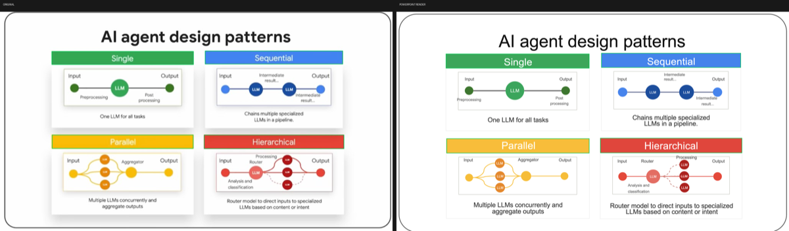

# Screenshot → Editable PowerPoint

> Paste a **slide screenshot**. Get a **native editable `.pptx`** — real shapes, real text, grouped icons. Not a pasted picture.

[](LICENSE)
[](#)
[](#three-gates-before-delivery)
[](https://github.com/cliffkwok/screenshot-to-editable-pptx)

<p align="center">
  
</p>

<p align="center"><em>Left: original screenshot · Right: PowerPoint slideshow raster of the rebuilt editable deck</em></p>

---

## Why this exists

Most “screenshot to PPT” tools embed the image. That looks fine until you need to edit a word, recolor a card, or move an icon.

This skill rebuilds the slide with **object-level PowerPoint shapes** and refuses to deliver until automated gates say the rebuild matches the photo.

## What’s new (measure-first universal skill)

| Area | What you get |
|------|----------------|
| **Layout vs component** | Same skill, two modes — full-page composition principles *or* nest/internals only ([07-layout.md](references/rules/07-layout.md)) |
| **Layers A / B / C** | Complex art → measured PNG crops (+ optional vectorize); structure → native shapes; text → editable runs ([08-layers.md](references/rules/08-layers.md)) |
| **Contact sheet** | Review every Layer A crop before build (`scripts/contact_sheet.py`) |
| **png-fallback** | Visible PPT image is PNG; SVG kept on disk when vectorize runs |
| **layout.json assemble** | Declarative build: `scripts/build_pptx_from_layout.py` ([layout-json.md](references/rules/layout-json.md)) |
| **Optional OCR** | Fill strings only onto **already measured** boxes (`ocr_fill_text.py`) |
| **Job + local repair** | Per-page dirs (`init_job.py`); fix one element, don’t rebuild the world ([09-job-workflow.md](references/rules/09-job-workflow.md)) |
| **Text↔text gaps** | Always measure title→sub, label→body, sentence→link; one-liners stay `wrap=False` |
| **No full-slide white backing** | Page color via `set_background` only — no selectable full-slide rect |
| **Progress = track + fill** | Grey track (back) + black/accent fill (front) — two overlapping layers |
| **Pre-delivery checklist** | Category HARD gates before the three automated scripts ([pre-delivery-checklist.md](references/pre-delivery-checklist.md)) |

Law in one line: **measure every element against its neighbors — including text↔text and layers inside a shape. Never guess. Never copy pads from another screenshot.**

## Features

- **Native shapes + text** — rectangles, rounds, connectors, grouped icons; never a full-slide screenshot paste
- **Universal measure rule** — every element placed by distance to neighbors (up/down/left/right); flow-group vs surrounding pads; wrap from the photo — see [references/universal-measure-rule.md](references/universal-measure-rule.md)
- **Glyph-box font sizing** — point size from **cap-height** + in-shape `pad_frac`, not a guessed `pt`
- **Measured text modes** — single-line labels (`wrap=False`) vs caption placeholders (`wrap=True`) only when the photo wraps
- **Measured bold** — stem contrast decides weight; no assumed bold (e.g. “Back” is often regular)
- **Attached connectors** — OOXML `stCxn` / `endCxn` when lines should stick to shapes; straight / elbow / curve from photo
- **Meaningful grouping** — one group per card / icon / badge; capsule+dots as top-level icon groups
- **Fail-closed delivery** — checklist + three gates must pass before the agent sends the file

## Three gates before delivery

| Gate | Script | What it checks |
|------|--------|----------------|
| **Source** | `source_audit.py` | Spec text boxes sit on real ink in the **original** photo; glyph height matches declared pt |
| **Structure** | `verify_pptx.py` | Shape type/size/position, font name/size/weight/color, sampled fill colors (`slide_background` = real slide fill, not a fake rect) |
| **Visual** | `compare_render.py` | **Real PowerPoint slideshow raster** vs original (card IoU / pixel MAE, no origin-stacked groups) |

XML that “looks right” is not enough. PowerPoint must draw it correctly.

## Install

### Cursor

```bash
git clone https://github.com/cliffkwok/screenshot-to-editable-pptx.git
mkdir -p ~/.cursor/skills
ln -s "$(pwd)/screenshot-to-editable-pptx" ~/.cursor/skills/screenshot-to-editable-ppt
pip3 install -r requirements.txt
```

Optional project rule (always-on reminder): copy `.cursor/rules/screenshot-to-editable-ppt.mdc` into your project’s `.cursor/rules/`.

### Claude Code (plugin marketplace)

```text
/plugin marketplace add https://github.com/cliffkwok/screenshot-to-editable-pptx
/plugin install screenshot-to-editable-pptx@screenshot-to-editable-pptx
```

Then invoke the skill when you paste a screenshot and ask for an editable PowerPoint.

### Manual

Clone this repo and point your agent’s skills folder at it (same layout as Cursor above).

## Requirements

- Python 3 + `pip3 install -r requirements.txt` (`python-pptx`, `Pillow`, `lxml`)
- [Tesseract](https://github.com/tesseract-ocr/tesseract) CLI optional (`eng+chi_tra`) for `ocr_fill_text.py` / line hints
- **Microsoft PowerPoint on macOS** for `export_slide_png.py` / visual compare (Quick Look is not a valid render)

## Use

Paste a slide screenshot and ask:

> Rebuild this as an editable PowerPoint — shapes, fonts, and colors must match.

The agent will:

1. Infer **layout** vs **component** mode; classify Layer **A/B/C**
2. Measure every neighbor gap (including **text↔text**); sample colors (no guessed hex)
3. Crop Layer A assets → contact sheet; optional OCR for strings only
4. Assemble via `layout.json` / native helpers (page color = `set_background`, no full-slide white shape)
5. Run **checklist → source_audit → verify_pptx → export → compare_render**
6. Deliver the `.pptx` **only** if checklist + all three reports pass

After **any** edit: local repair when possible, then rebuild and re-run gates.

### Quick assemble path

```bash
python3 scripts/init_job.py --job work/my-deck --image shot.png
# …measure → write pages/page_001/layout.json + assets…
python3 scripts/contact_sheet.py --assets pages/page_001/assets --out pages/page_001/assets/_contact_sheet.png
python3 scripts/ocr_fill_text.py --image pages/page_001/source.png --layout pages/page_001/layout.json --out pages/page_001/layout.json
python3 scripts/build_pptx_from_layout.py --layout pages/page_001/layout.json --assets-root pages/page_001 --out pages/page_001/page.pptx
```

## Verify locally

```bash
python3 scripts/text_hints.py --image screenshot.png --out text_hints.json --overlay text_hints.png
python3 scripts/source_audit.py --spec spec.json --original screenshot.png --hints text_hints.json --out source_audit.json
python3 scripts/verify_pptx.py --pptx slide.pptx --spec spec.json --original screenshot.png --out verify_report.json
python3 scripts/export_slide_png.py --pptx slide.pptx --out render.png
python3 scripts/compare_render.py --original screenshot.png --render render.png --out compare
```

Exit `0` = pass. Exit `1` = do not deliver.

## Architecture (progressive disclosure)

The main `SKILL.md` is a workflow map. Supporting files load only when needed:

| File | Purpose | Loaded when |
|------|---------|-------------|
| `SKILL.md` | Core workflow + hard gates | Always |
| `references/universal-measure-rule.md` | Measure law + pipeline | Every rebuild |
| `references/pre-delivery-checklist.md` | Category HARD checks | Before delivery |
| `references/rules/07–09 + layout-json` | Layout mode, layers, jobs | Multi-region / multi-page / Layer A |
| `scripts/build_pptx_from_layout.py` | Assemble from `layout.json` | Universal path |
| `scripts/contact_sheet.py` / `ocr_fill_text.py` / `init_job.py` | Ops enrichments | When using layers / OCR / jobs |
| `scripts/text_hints.py` | Ink boxes + glyph→pt | Before locking text into the spec |
| `scripts/source_audit.py` | Spec vs original photo | Before claiming the layout is locked |
| `scripts/verify_pptx.py` | Shape / font / color | Before visual compare |
| `scripts/export_slide_png.py` + `compare_render.py` | Real PPT raster vs photo | Before delivery |
| `examples/walkthrough.md` | End-to-end walkthrough | Onboarding |

## Accuracy notes (what we learned from peer skills)

[frontend-slides](https://github.com/zarazhangrui/frontend-slides) is an **HTML deck authoring** skill — different product. What transfers for *accuracy*:

1. **Fail-closed after any edit** — re-verify at fixed stage size; do not trust “looks fine in XML”
2. **Progressive disclosure** — measure scripts and reference docs load on demand, not all at once
3. **Visual proof is mandatory** — side-by-side raster compare before delivery

What does **not** transfer: style presets, CSS animation packs, Vercel deploy, PPT→HTML extraction. Those solve authoring/sharing, not photo→native-PPT reconstruction.

## Layout

```
screenshot-to-editable-pptx/
├── SKILL.md
├── README.md
├── LICENSE
├── requirements.txt
├── .claude-plugin/marketplace.json
├── plugins/screenshot-to-editable-pptx/   # Claude Code plugin wrapper
├── scripts/                              # measure · build · audit · verify · compare
├── references/
│   ├── universal-measure-rule.md
│   ├── pre-delivery-checklist.md
│   └── rules/                            # 01–09 + LEARNINGS + layout-json
├── examples/
└── docs/                                 # GitHub Pages gallery
```

## Philosophy

1. **Editable means editable** — if you can’t select the text, it isn’t done.
2. **Measure, don’t guess** — hex, inches, and pt come from pixels and glyph boxes.
3. **The photo is the source of truth** — specs that only match themselves fail `source_audit`.
4. **Gates protect the user** — the agent is not allowed to “ship and hope.”

## Credits

Built for Cursor / Claude agent workflows. Packaging patterns inspired by [@zarazhangrui/frontend-slides](https://github.com/zarazhangrui/frontend-slides).

## License

MIT — use it, modify it, share it.
